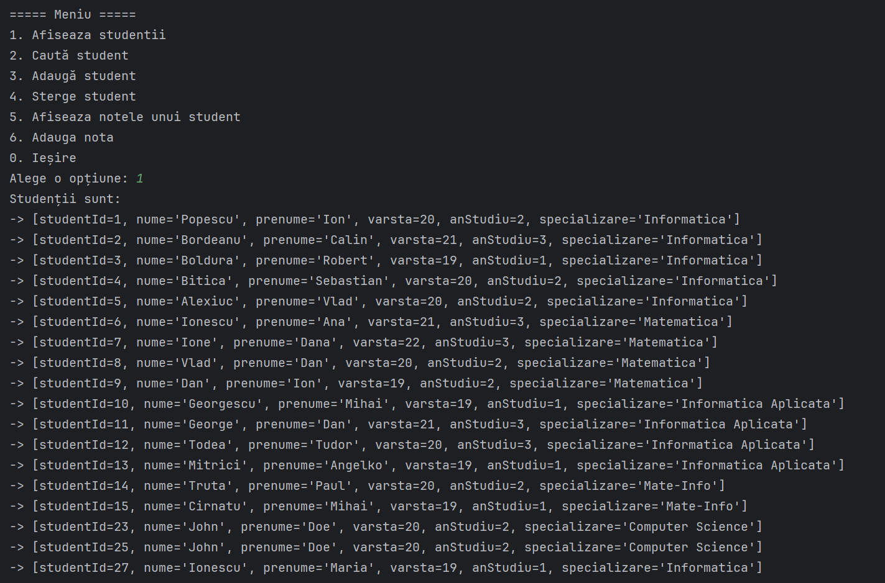
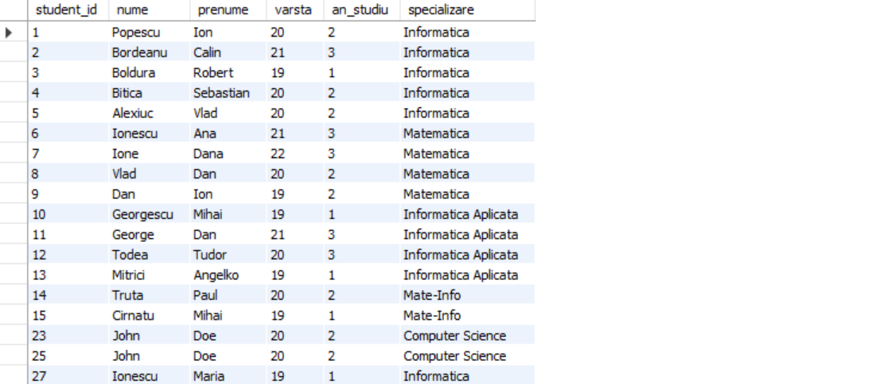

# Project Title
### Student Management System

## Description
The application is designed to assist a college or educational institution in managing and storing student data efficiently and organized manner. This application provides users the ability to add, edit, delete, and search for registered students, as well as view relevant information about them. Additionally, it allows for grading students. It uses a file handling mechanism to save and retrieve data and employs data structures for storage.

## Objectives

* Operations included:
  - Add Student
  - Edit Student
  - Delete Student
  - Search Student
* Grade Addition:
  - Functionality to add grades for students
* Graphical User Interface
  - JavaSWING
* Database
  - MySQL

## Screenshots

## Features/Usage Examples
* Add Student:
    - Users can input the details of a new student, including name, specialization, and grades.

* Edit Student:
    - There is an option to modify the details of an existing student, including name, specialization, and grades.

* Delete Student:
    - Users can remove a student from the database.

* Search Student:
    - It is possible to search for a student by name or other criteria to quickly access information about them.

* View Student Information:
    - Users can view complete details of a student, such as name, specialization, and grades.

* Add Student Grades:
    - Users (Professors) can manually input grades for students.

* Data Storage in Files:
    - All student data is saved in files for preservation between sessions.

