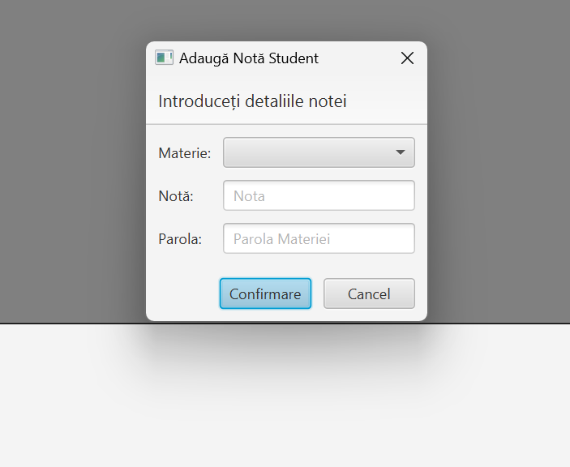

### Student Management System

## Description
The application is designed to assist a college or educational institution in managing and storing student data efficiently and organized manner. This application provides users the ability to add, edit, delete, and search for registered students, as well as view relevant information about them. Additionally, it allows for grading students. It uses a file handling mechanism to save and retrieve data and employs data structures for storage.

## Technologies
* **Basic CRUD Operations:**
  - Add Student
  - Edit Student
  - Delete Student
  - Search Student with Filtering Functionality

* **Grade Addition:**
  - Functionality to add grades for students, requiring authentication.

* **Graphical Interface:**
  - Developed using JavaFX for an interactive and intuitive user experience.

* **Database:**
  - Utilizes MySQL for efficient storage and retrieval of data.

## App
|              Main Page               |          Add Student Page           |
|:------------------------------------:|:-----------------------------------:|
|        |       |
|           Student Details            |           Add Grade Page            |
|  |  |